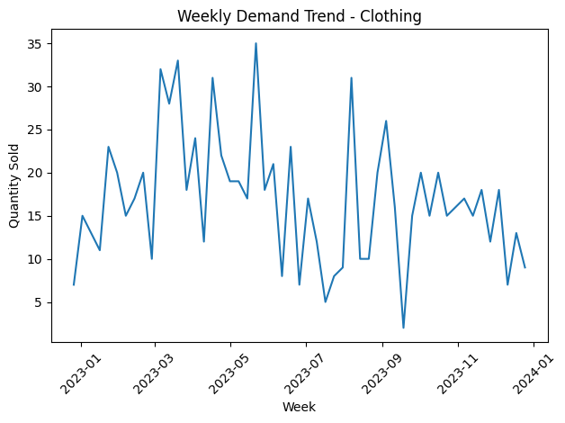
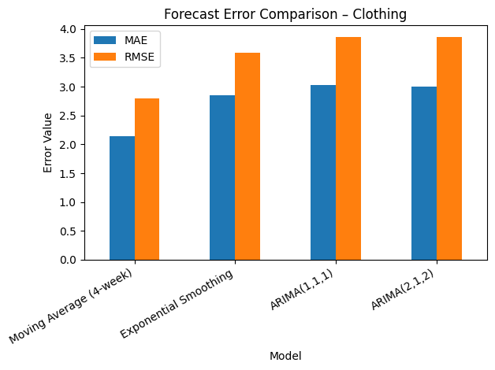

# Demand Forecasting & Inventory Insight (Retail Case Study)

## 📌 Business Problem
Retail businesses often struggle to balance product availability and inventory costs due to fluctuating customer demand. Inaccurate demand planning can lead to stock-outs (lost sales) or overstocking (higher holding costs and waste). This project explores how demand forecasting can support better inventory decisions and reduce operational risk while providing actionable insights for replenishment planning.

## 📊 Dataset
- **Source:** Public retail transaction dataset (2023)  
- **Size:** 1,000 sales records  
- **Key attributes:** transaction date, product category, quantity sold  
- **Processing:** Transactions were aggregated into **weekly demand at the product category level** to enable time-series forecasting.

## 🧠 Approach
1. **Exploratory Data Analysis (EDA)**  
   - Analyzed demand trends and variability across product categories.  

2. **Forecasting Models**  
   - **Baseline:** 4-week Moving Average  
   - **Advanced models:**  
     - Exponential Smoothing  
     - ARIMA (1,1,1) and ARIMA (2,1,2)

3. **Model Evaluation**  
   - Compared performance using **MAE (Mean Absolute Error)** and **RMSE (Root Mean Squared Error)**.

4. **Business Interpretation**  
   - Translated numerical results into practical inventory insights rather than focusing solely on statistical performance.

## 📈 Key Results
- **Clothing** was selected as the main category due to its highest sales volume.
- Weekly demand showed high variability but no clear seasonal pattern.
- Moving Average achieved the lowest numerical error but reacted slowly to demand spikes.
- Exponential Smoothing provided a better balance between responsiveness and stability, making it more suitable for short-term planning.

## 📈 Visualizations

## 📦 Inventory Insights & Recommendations
- Use **Exponential Smoothing** for short-term replenishment planning.
- Keep **Moving Average** as a simple strategic benchmark.
- Closely monitor high-demand weeks to mitigate stock-out risk.

## 🔮 Limitations & Future Work
- Forecasting was performed at the **category level**; future work could model demand at the **product level** for more granular insights.  
- External factors such as promotions, holidays, and pricing were not included and could improve forecast accuracy.  
- A production-ready version could automate weekly forecast updates and generate real-time alerts for potential stock-outs.

## 🛠️ Requirements
See `requirements.txt`

